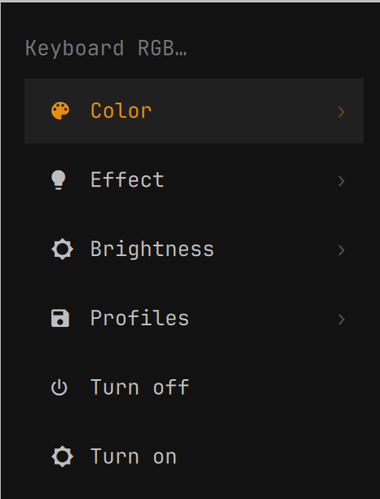
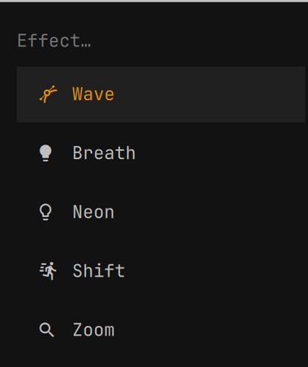

# predator-kb

4-zone RGB keyboard control for **Acer Predator** laptops on Linux, with an
optional [Omarchy](https://omarchy.org/) integration.

Tested on a **Predator PH315-54** (Helios 300) running kernel 7.2, Hyprland and Omarchy.

```bash
predator-kb color ff0055                        # all four zones
predator-kb color ff0000 ffaa00 00ff88 0088ff   # one color per zone
predator-kb wave -s 6                           # rainbow wave
predator-kb breath 8000ff -s 3 -b 60            # purple breathing
predator-kb off
```

<p align="center">
  
  &nbsp;&nbsp;
  
</p>

## Why this is needed

The kernel's stock `acer-wmi` **doesn't expose this keyboard's RGB** — nothing
shows up under `/sys/class/leds`. The methods do exist in firmware, behind Acer's
gaming WMI interface (GUID `7A4DDFE7-5B5D-40B4-8595-4408E0CC7F56`), but only the
[`facer`](https://github.com/JafarAkhondali/acer-predator-turbo-and-rgb-keyboard-linux-module)
driver implements them.

This project **doesn't reimplement the driver**. It installs `facer` through DKMS
and builds on top of it what was missing for day-to-day use: a CLI, profile
persistence across reboots and suspends, and the Omarchy integration.

`facer` exposes two char devices, already mode `0666` — nothing here needs sudo
after install:

| Device | Payload | Purpose |
|---|---|---|
| `/dev/acer-gkbbl-static-0` | 4 bytes: `zone_bitmask, R, G, B` | per-zone solid color |
| `/dev/acer-gkbbl-0` | 16 bytes: `mode, speed, brightness, flag, dir, R, G, B, 0, 1, …` | effects and brightness |

## Install

Requirements: `dkms`, `git`, `make`, `gcc` and your **kernel headers**
(`linux-headers`, `linux-lts-headers`, `linux-omarchy-headers`, … whichever matches).

```bash
git clone https://github.com/luccas-santos01/predator-kb.git
cd predator-kb
./install.sh
```

Run it as your normal user — the script calls `sudo` only where it must, so it
needs a real terminal for the password prompt. Pass `--no-omarchy` to skip the
menu and keybindings.

The installer checks your model and the gaming WMI before touching anything,
builds `facer` through DKMS (which rebuilds it on every new kernel), and
blacklists `acer_wmi` — both claim the same WMI GUIDs and can't coexist.

> `facer` is a **fork of `acer-wmi`**, so this is a driver swap rather than an
> addition. You don't lose functionality; you gain the RGB, turbo mode and fan
> control.

To undo everything and restore `acer_wmi`: `./uninstall.sh`

## Usage

```
STATIC COLORS
  predator-kb color <color>                  all four zones, one color
  predator-kb color <c1> <c2> <c3> <c4>      one color per zone (left to right)
  predator-kb zone <1-4> <color>             change a single zone

EFFECTS
  predator-kb breath [color] [options]       fade in and out
  predator-kb neon [options]                 neon glow
  predator-kb wave [options]                 rainbow wave
  predator-kb shift [color] [options]        shifting light
  predator-kb zoom [color] [options]         zoom pulse

OPTIONS       -s <0-9> speed   -b <0-100> brightness   -d <1|2> direction

BRIGHTNESS    predator-kb brightness <0-100> | up | down | off | on | toggle
PROFILES      predator-kb save <name> | load <name> | list
STATE         predator-kb status | restore
```

Colors accept `RRGGBB`, `#RRGGBB` or a name (`red`, `blue`, `purple`, `orange`, …).

## Persistence

Firmware resets the backlight on reboot and on resume from suspend. The installer
covers both:

- `~/.config/systemd/user/predator-kb-restore.service` — re-applies at login
- `/usr/lib/systemd/system-sleep/predator-kb` — re-applies on wake

Both run `predator-kb restore`, which reads `~/.config/predator-kb/profile` —
rewritten by every command. In other words: whatever you last set is what comes back.

## Omarchy integration

Installed automatically when `~/.config/omarchy` exists.

| Key | Action |
|---|---|
| `SUPER + SHIFT + K` | Open the **Keyboard RGB** menu |
| `XF86KbdBrightnessUp` | Brightness +20 |
| `XF86KbdBrightnessDown` | Brightness −20 |
| `XF86KbdLightOnOff` | Toggle the backlight |

Omarchy's stock media bindings point those three keys at
`/sys/class/leds/*kbd_backlight*`, which Predator laptops don't expose — so they
fail silently out of the box. The integration `hl.unbind`s them first and takes
them over.

The menu entry carries `when: test -w /dev/acer-gkbbl-0`, so it hides itself if
the driver isn't loaded. Beyond the presets shown above, **Color → Custom** and
**Profiles → Save** prompt for free-form input.

Blocks written into `bindings.lua` and `omarchy-menu.jsonc` are wrapped in
`predator-kb:begin`/`:end` markers, so reinstalling never duplicates them and
uninstalling leaves nothing behind. Both files are copied to `.bak.<timestamp>`
before any edit.

## Other models

`facer` claims support for much of the Predator/Nitro line
(PH315-52/53/54/55, PH317-53/54, PT315-51, PHN18-71, AN515-58 and more) — see the
[upstream table](https://github.com/JafarAkhondali/acer-predator-turbo-and-rgb-keyboard-linux-module#supported-models).
If your model has four zones and is on that list, this should work.

Per-key RGB is not supported — that limit comes from the firmware/WMI, not the driver.

The installer warns about unknown models but doesn't block. If the device nodes
appear and the keyboard still doesn't react, your model likely needs a new quirk
in `facer` — that belongs
[upstream](https://github.com/JafarAkhondali/acer-predator-turbo-and-rgb-keyboard-linux-module/issues).

## Troubleshooting

```bash
dkms status | grep facer      # should say "installed"
lsmod | grep facer            # should be loaded
ls -l /dev/acer-gkbbl-*       # should exist, mode crw-rw-rw-
sudo dmesg | grep -i facer
predator-kb status
```

If the RGB stops after a kernel update, it's almost always DKMS failing to
rebuild because the headers for the new version are missing. Install them and run
`sudo dkms autoinstall`.

## Credits

The driver is [`facer`](https://github.com/JafarAkhondali/acer-predator-turbo-and-rgb-keyboard-linux-module)
by Jafar Akhondali and contributors, licensed GPL-2.0 — it does the real work.
This repository doesn't redistribute its code; `install.sh` clones upstream at
install time.

The scripts here are MIT licensed (see `LICENSE`).
